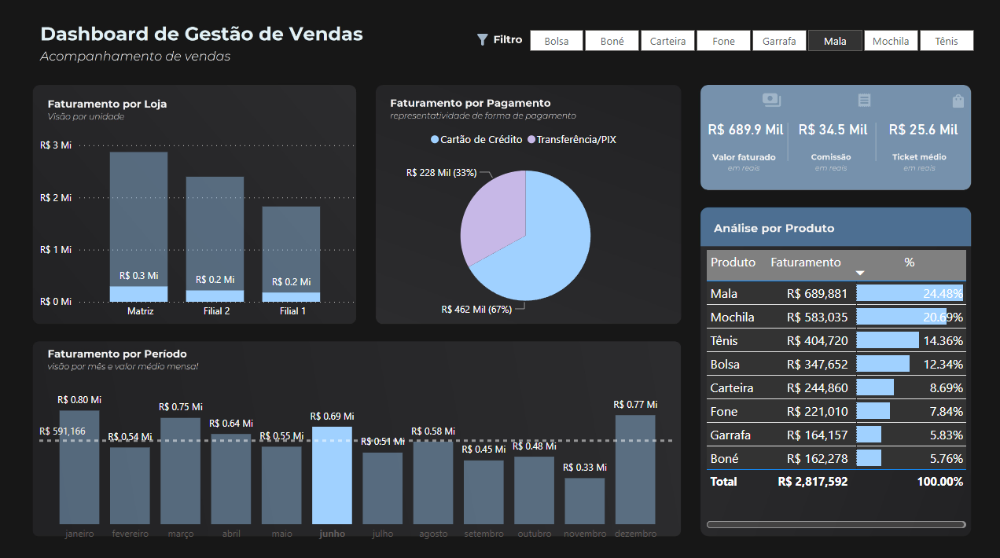

# Dashboard de Gestão de Vendas

Este projeto é um dashboard interativo desenvolvido no Power BI para acompanhar as vendas de uma empresa.

## Funcionalidades
- **Faturamento por Loja:** Visualização do faturamento.
- **Faturamento por Período:** Análise mensal do faturamento.
- **Análise por Produto:** Faturamento detalhado por tipo de produto.
- **Faturamento por Pagamento:** Representação das formas de pagamento.

## Tecnologias Utilizadas
- **Excel:** Fonte de dados.
- **Power Query:** Tratamento e transformação de dados.
- **Power BI:** Criação das visualizações e dashboard.

## Capturas de Tela

## Como Reproduzir
1. Baixe o arquivo `dashboard-gestao-vendas.pbix` da pasta `powerbi/`.
2. Abra o arquivo no Power BI Desktop.
3. Conecte ao arquivo Excel localizado na pasta `data/`.

